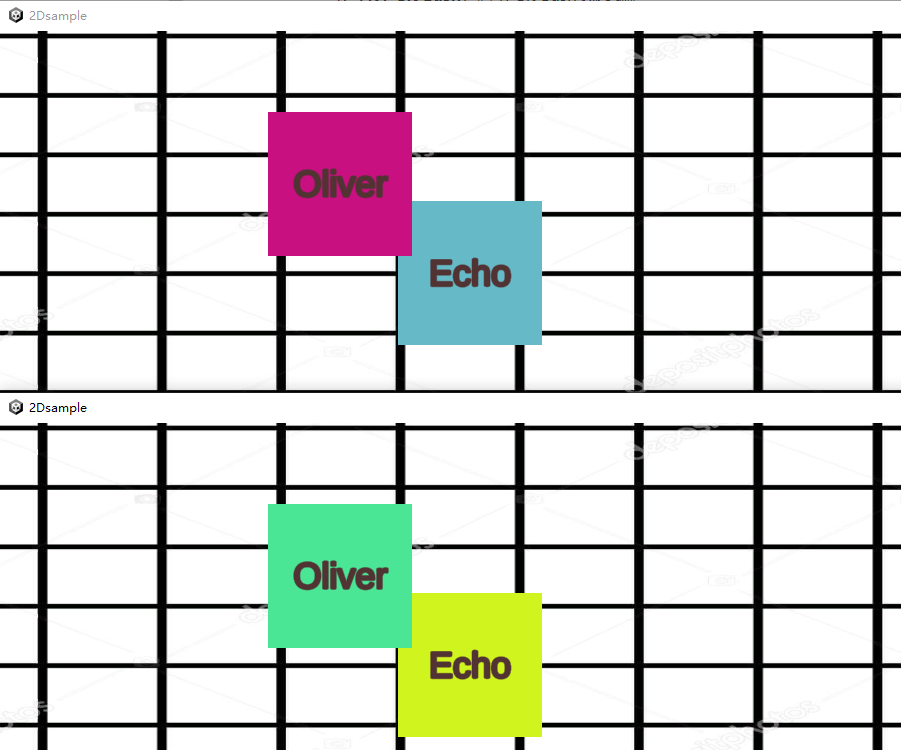

# frame-sync-example
帧同步游戏示例

## 说明

- 参考 [LockstepDemo](https://github.com/AlbertGithubHome/LockstepDemo) 实现，很粗糙但花费了1day的时间
- 默认需要两个客户端加入，如果要修改最大人数，修改 `frame-sync-server/server.py` 文件中的 `g_max_player` 值
- 默认25帧，如需改变要修改前后端代码
  - 前端修改 `Assets/DelayedSpawner.cs` 文件中的的 `g_interval` 值（每帧毫秒数）
  - 后端修改 `frame-sync-server/server.py` 文件中的 `g_interval` 值（每帧毫秒数）
- 后台运行勾选了 `Project Settings` -> `Player` -> `Resolution and Presentation` -> `Resolution` -> `Run In Background`
- Unity版本为 `2021.3.6f1c1 LTS` 版本，`2D (Built-In Render Pipeline)` 工程
- Python版本 `3.7.6`

## 如何运行

- 服务端
```shell
$ cd frame-sync-server
$ python3 server.py
```

- 客户端

```
打开工程直接调试运行，或者Build一个Windows平台的exe运行
```

## 示例截图


